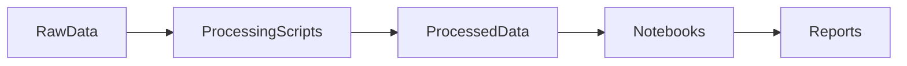

# Retail Access vs. Social Cost: Store Locations, Sales Trends, and the Measured Social Impact of Legal Cannabis in Canada

## 🎯 Project Goal

This project undertakes an in-depth, multi-faceted analysis of the legalized cannabis market in Canada. It focuses on the interplay between **retail infrastructure (store locations)**, **economic performance (sales trends)**, and **social impact (cannabis-related crime data)** since legalization.

The primary objective is to synthesize disparate public data sources from Health Canada and Statistics Canada into a cohesive, interactive analytical report. This report will address key questions about the rollout of legalized cannabis, its commercial footprint, and its measurable impact on crime statistics across Canadian provinces and territories.

## 🏛️ Project Context

This project is a requirement for the **SEP 6DA3: Data Analytics and Big Data** course at **McMaster University**.

## 📊 Data Sources

The analysis relies on four primary publicly available data sources provided by the Government of Canada and Statistics Canada. All raw data is stored in the `data/01_raw_data` directory.

| Data Source                                 | Source URL                                                                                                                                                                                                                                                          | Content Summary                                                                                                                                         |
| :------------------------------------------ | :------------------------------------------------------------------------------------------------------------------------------------------------------------------------------------------------------------------------------------------------------------------ | :------------------------------------------------------------------------------------------------------------------------------------------------------ |
| **Store Locations** (Provincial Frameworks) | [Health Canada Link](https://www.canada.ca/en/health-canada/services/drugs-medication/cannabis/laws-regulations/provinces-territories.html)                                                                                                                         | Regulatory frameworks and links to provincial/territorial lists of licensed cannabis store operators. **Source for the master store location dataset.** |
| **Cannabis Sales**                          | [StatCan - Cannabis Sales](https://www150.statcan.gc.ca/t1/tbl1/en/tv.action?pid=1010016401)                                                                                                                                                                        | Aggregate monthly cannabis sales data by province and territory.                                                                                        |
| **Monthly Retail Trade Sales**              | [StatCan - Retail Trade](https://www150.statcan.gc.ca/t1/tbl1/en/tv.action?pid=2010005601)                                                                                                                                                                          | Broader monthly retail trade data for context and normalization.                                                                                        |
| **Cannabis-Related Crimes (National)**      | [StatCan - Crime Stats](https://www150.statcan.gc.ca/t1/tbl1/en/tv.action?pid=3510017701)                                                                                                                                                                           | Statistics on offenses under the Cannabis Act.                                                                                                          |
| **Cannabis-Related Crimes (Local)**         | [Toronto Crime Data](https://data.torontopolice.on.ca/search?collection=dataset&layout=grid/) / [Vancouver Police Data](https://geodash.vpd.ca/opendata/) / [Edmonton Police Data](https://experience.arcgis.com/experience/8e2c6c41933e48a79faa90048d9a459d/page/) | Local crime data for city-level density analysis.                                                                                                       |

## Flow Diagram



## 🎥 Dashboard Walkthrough Video

A complete interactive demonstration of the Cannabis Sales vs Crimes Analysis Dashboard is available below.
This video showcases all dashboard pages, filtering mechanics, drill-through interactions, and key findings.

<a href="https://youtu.be/qlbNaVQAyNI" target="_blank">
  
</a>

<br>

## 📊 Core Dashboard Components

### Canada Wide Cannabis Sales Analysis

A time-series view showing the long-term trend of total monthly cannabis sales nationally since legalization, along with short-term metrics like Rolling 12-Month Sales and Month-over-Month (MoM) Growth Percentage.


**Key Data Presented:**

- Total Monthly Sales (since 2019)
- Rolling 12-Month Sales trend
- Month-over-Month (MoM) Sales Growth %

---

### Store Locations

A high-level, interactive map of Canada displaying the geographic distribution and density of licensed cannabis retail stores across the country, color-coded by province.


**Key Data Presented:**

- Geographic coordinates of all operating cannabis retail stores, grouped by Province

## 📦 Published Kaggle Dataset

The cleaned master dataset of all cannabis retail stores in Canada is publicly available:

### **Kaggle Dataset:** https://www.kaggle.com/datasets/jainishpatel31/cannabis-store-locations-across-canada/

- This dataset contains store-level metadata, provincial distribution, and geocoded coordinates, and is used for the geospatial analysis in this report.

---

### Cannabis Retail Sales by Province

Tracks quarterly and yearly total sales performance across all provinces, showing market-leading jurisdictions in terms of revenue.


**Key Data Presented:**

- Quarterly/Yearly Total Sales trends for all Canadian provinces
- Proportional contribution to national market (pie chart)

---

### Cannabis Retail Sales by Cities

Comparative view of total cannabis sales over time across major Canadian cities, identifying key urban markets and their growth trajectories.


**Key Data Presented:**

- Quarterly/Yearly Total Sales trends for top cities (Toronto, Montréal, Edmonton, Calgary, Vancouver)
- Respective sales contributions of each city

---

### Cannabis Retail Sales By Type

Analysis of the market share and sales trends for different cannabis product categories (e.g., Dried Cannabis, Edibles, Vapes), highlighting product maturity and consumer preference shifts.


**Key Data Presented:**

- Total Sales trends (2022-2024)
- Unit Sales breakdown across product types (Dried Cannabis, Ingested/Inhaled Extracts, Edibles, Beverages, Topicals)

---

### Canada Wide Crime Analysis

A multi-panel view analyzing the trend of total actual crimes in Canada over a long period (since 1995), broken down by province. The heatmap visually highlights provinces with the highest crime levels.


**Key Data Presented:**

- Total Actual Crimes (absolute counts) over time
- Provincial breakdown of total crime trends

---

### Major Cities Crime Analysis

Deep-dive into crime trends for major Canadian cities, providing comparative insight across urban centers.


**Key Data Presented:**

- City-wise crime totals and trends
- Comparative analysis across major cities

---

### Toronto Crime Analysis

Specialized view for Toronto focusing on public health and safety metrics, including traffic collisions, "Person in Crisis" events, and overall "Calls for Service."


**Key Data Presented:**

- Total collisions by type (Fatal, Injury, Property Damage)
- Count of "Person in Crisis" events (Overdose, Suicide-related)
- Total Annual Calls for Service

---

### Vancouver Crime Analysis

Localized deep-dive into Vancouver crime statistics, showing trends for key property and violent crime categories and their spatial distribution across neighbourhoods.


**Key Data Presented:**

- Yearly totals of crimes by category (Break and Enter, Theft, Mischief, Offence Against a Person)
- Crime trends by major neighbourhood
- Spatial map of crime incidents

---

### Edmonton Crime Analysis

Localized deep-dive into Edmonton crime statistics, breaking down total crimes by general categories (Violent, Traffic, Drugs) and specific categories (Drug Violation, Disorder, Mischief), including a spatial map.


**Key Data Presented:**

- Yearly totals of crimes by high-level and detailed category
- Spatial map of crime incidents by location

  <br>

## 📁 Repository Structure

<!-- TREEVIEW START -->

```
├── data/
│   ├── 01_raw_data/              # Original, untouched data files (read-only)
│   │   ├── 01_store_locations/   # Raw data for provincial/territorial store lists.
│   │   ├── 02_cannabis_sales/    # Raw aggregate monthly sales data (StatCan).
│   │   ├── 03_retail_trade/      # Raw monthly retail trade data for normalization (StatCan).
│   │   ├── 04_crime_data/        # Raw national Cannabis Act offense data (StatCan).
│   │   └── 05_crime_by_city_data/ # Raw localized crime data (Toronto, Vancouver, etc.).
│   ├── 02_processed_data/    # Intermediate data (cleaned, aggregated, geo-coded, merged).
│   │   ├── 01_store_locations/   # Processed data for provincial/territorial store lists.
│   │   ├── 02_cannabis_sales/    # Processed aggregate monthly sales data (StatCan).
│   │   ├── 03_retail_trade/      # Processed monthly retail trade data for normalization (StatCan).
│   │   ├── 04_crime_data/        # Processed national Cannabis Act offense data (StatCan).
│   │   └── 05_crime_by_city_data/ # Processed localized crime data (Toronto, Vancouver, etc.).
│   └── 03_final_outputs/     # Final datasets ready for use (master datasets, combined/cleaned files)
│       ├── crime_city_level.parquet           # Cleaned city-level crime data for all cities.
│       ├── crime_province_national.parquet   # National/provincial-level crime data (aggregated).
│       ├── dataset_shape_report.txt           # Report of rows x columns for all final datasets.
│       ├── edmonton_crimes.parquet           # Processed crime data specific to Edmonton.
│       ├── retail_trade_data.csv             # Processed retail trade data ready for analysis.
│       ├── sales_data.csv                     # Cleaned cannabis sales data for analysis.
│       ├── store_locations.csv               # Final master list of cannabis store locations.
│       ├── toronto_calls_for_service.csv     # Processed 311 calls / service request data for Toronto.
│       ├── toronto_person_in_crisis.csv     # Processed social crisis data for Toronto.
│       ├── toronto_traffic_collisions.parquet # Cleaned traffic collision data for Toronto.
│       └── vancouver_crimes.csv             # Processed crime data specific to Vancouver.
├── notebooks/                # Jupyter notebooks for modular analysis and reporting.
│    ├── data_ingestion_cleaning/  # Notebooks focused only on cleaning and initial processing.
│    │   ├── 01_store_locations_data_ingestion_cleaning.ipynb
│    │   ├── 02_cannabis_sales_data_ingestion_cleaning.ipynb
│    │   ├── 03_retail_trade_data_ingestion_cleaning.ipynb
│    │   ├── 04_crime_data_high_level_data_ingestion_cleaning.ipynb
│    │   └── 05_crime_by_city_data_ingestion_cleaning.ipynb
│    ├── exploratory_analysis/   # Notebooks focused only on visualization and descriptive stats.
│    │   ├── 01_store_locations_exploratory_analysis.ipynb
│    │   ├── 02_cannabis_sales_exploratory_analysis.ipynb
│    │   ├── 03_retail_trade_exploratory_analysis.ipynb
│    │   ├── 04_crime_data_high_level_exploratory_analysis.ipynb
│    │   └── 05_crime_by_city_data_exploratory_analysis.ipynb
├── src/                      # Core Python code and pipeline artifacts
│   ├── data_pipeline.py      # Main ETL pipeline script that processes cannabis datasets (store locations, sales, retail trade, and crime data) end-to-end.
│   └── requirements.txt         # List of Python dependencies required to run the pipeline and reporting scripts.
├── reports/                 # Final project deliverables and presentations.
│   ├── Dashboard/           # Interactive visualization files.
│   │   ├── Cannabis Sales vs Crimes Analysis Dashboard.pbix # The Power BI dashboard file.
│   │   └── Project Logo.png
│   ├── Dashboard Visuals/   # Views Images.
│   │   ├── Canada Wide Cannabis Sales Analysis.png
│   │   ├── Cannabis Store Locations.png
│   │   ├── Cannabis Retail Sales by Province.png
│   │   ├── Cannabis Retail Sales by Cities.png
│   │   ├── Cannabis Retail Sales by Type.png
│   │   ├── Canada Wide Crime Analysis.png
│   │   ├── Major Cities Crime Analysis.png
│   │   ├── Toronto Crime Analysis.png
│   │   ├── Vancouver Crime Analysis.png
│   │   └── Edmonton Crime Analysis.png
├── .gitignore                # Files/folders Git should ignore (e.g., environment files, large data).
└── README.md                 # Project overview and documentation.
```

<!-- TREEVIEW END -->

<br>

## 📄 Full Project Report

The complete written analysis for this project is available in PDF format:

### **[Report – Retail Access vs Social Cost](reports/Report%20-%20Retail%20Access%20vs%20Social%20Cost.pdf)**

<br>

## 🎤 Project Presentation (PDF)

The full presentation used to showcase the dashboard, analysis workflow, and findings is available below:

### **[Presentation – Retail Access vs Social Cost](reports/Presentation%20-%20Retail%20Access%20vs%20Social%20Cost.pdf)**

<br>

## 👥 Contributors

| Name                        | Student ID | Email                | GitHub Handle                                     |
| :-------------------------- | :--------- | :------------------- | :------------------------------------------------ |
| Parekh, Aayushi Chintan     | 400678333  | pareka13@mcmaster.ca | [`aayushi2812`](https://github.com/aayushi2812)   |
| Patel, Jainish Shaileshbhai | 400550277  | patej118@mcmaster.ca | [`polonium31`](https://github.com/polonium31)     |
| Patel, Mayur Kalabhai       | 400552080  | patem245@mcmaster.ca | [`mayur045`](https://github.com/mayur045)         |
| Patel, Priyaben             | 400676356  | patep280@mcmaster.ca | [`perry0716`](https://github.com/perry0716)       |
| Virani, Jenil Salimbhai     | 400591994  | viranj1@mcmaster.ca  | [`jenil-virani`](https://github.com/jenil-virani) |
| Moosani, Iliyan             | 400587184  | moosanii@mcmaster.ca | [`iliyanm10`](https://github.com/iliyanm10)       |
